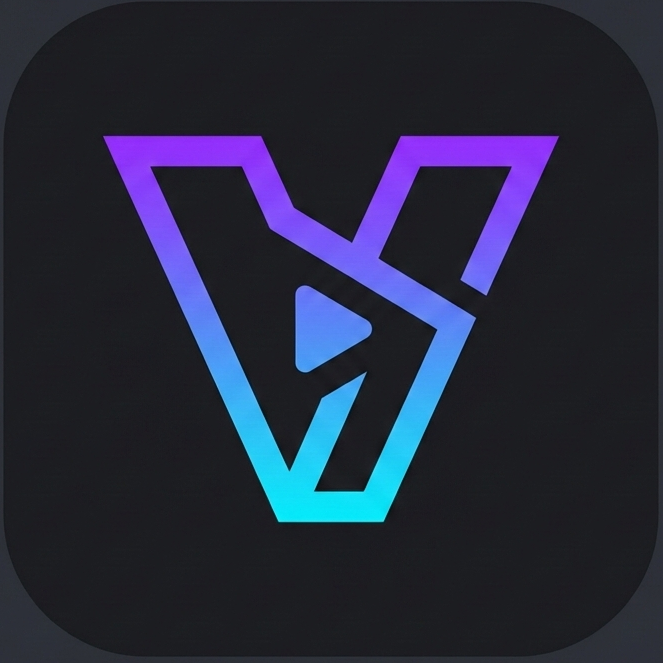
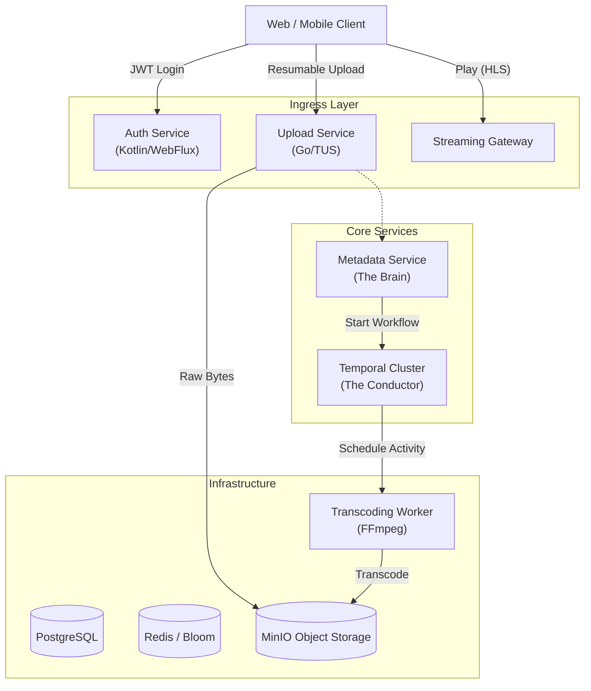

# VORA — Distributed Video Streaming Platform


**Vora** is a high-performance, fault-tolerant video streaming platform designed to handle the complex lifecycle of media: from unstable network ingestion to distributed transcoding and adaptive bitrate streaming (HLS).

This project demonstrates **Hexagonal Architecture**, **Reactive Programming**, and **Workflow Orchestration** to solve the common pitfalls of distributed media systems (partial failures, orphan states, and scaling bottlenecks).

---

## 🏗 High-Level Architecture

Vora strictly enforces a **"Smart Endpoints, Dumb Pipes"** philosophy. Business logic resides in domain-centric services, while long-running processes are managed by a durable execution engine (Temporal).



---

## 🧩 Microservices Breakdown

### 1. Authentication Service (`/auth-service`)
**Role:** Identity Provider & Security Perimeter.
*   **Tech Stack:** Kotlin, Spring Boot WebFlux, PostgreSQL (R2DBC), Redis (Redisson).
*   **Key Features:**
    *   **Non-blocking I/O:** Fully reactive chain from Controller to Database.
    *   **Bloom Filters:** Uses Redis Bloom Filters to reject duplicate registration emails in $O(1)$ time / constant space, preventing DB hits for existing users.
    *   **Resilience:** Implements a Dead Letter Queue (DLQ) via Redis Streams to handle Bloom Filter sync failures.
    *   **MFA:** Support for TOTP (Google Authenticator) and Email OTPs.

### 2. Upload Service (`/upload-service`)
**Role:** High-throughput Ingestion Edge.
*   **Tech Stack:** Go (Golang), Gin, TUS Protocol.
*   **Design Philosophy:** "The Upload Service does not know what a video is."
*   **Key Features:**
    *   **TUS Protocol:** Supports pause, resume, and retry for uploads over unstable mobile networks.
    *   **Stateless:** Streams multipart chunks directly to S3/MinIO without local buffering.
    *   **Trust Boundary:** valid tokens are required, but identity logic is offloaded.

### 3. Metadata Service (Planned)
**Role:** The Authoritative Source of Truth.
*   **Role:** Manages the Video State Machine (`CREATED` -> `PROCESSING` -> `READY`).
*   **Responsibility:** Triggers Temporal workflows upon upload completion via Webhooks.

### 4. Workflow Engine (Temporal)
**Role:** Distributed Orchestrator.
*   **Problem Solved:** Replaces fragile cron jobs and message queues for complex video processing.
*   **Guarantee:** If a video starts processing, it *will* finish or fail cleanly. No "zombie" states.
*   **Activities:** Thumbnail generation, 360p/720p/1080p transcoding (FFmpeg).

---

## ⚡️ Key Engineering Decisions

### 1. Hexagonal Architecture (Ports & Adapters)
The `auth-service` strictly separates the **Domain** (Business Rules) from **Infrastructure** (DB/Web).
*   **Benefit:** We can swap the Notification adapter (currently SMTP) for Twilio or AWS SES without touching a single line of business logic.
*   **Testability:** Domain logic is tested with pure unit tests, mocking the "Ports."

### 2. State-First Design
We defined **Finite State Machines (FSM)** for Videos and Uploads *before* writing API endpoints.
*   *See [State Machine Design](docs/state-machine-design.md)*
*   **Benefit:** Prevents invalid transitions (e.g., a video going from `READY` back to `PROCESSING`) and ensures idempotency in distributed retries.

### 3. Resilience & Failure Contracts
We define specific "Blast Radii" for failures.
*   *See [Failure Contracts](docs/failure-contract.md)*
*   **Example:** If the **Analytics** service goes down, the **Streaming Gateway** drops events and keeps playing video. Playback never blocks on analytics.
*   **Example:** If **Bloom Filters** fail to update during registration, the event is pushed to a Redis Stream DLQ for async retry, ensuring the user registration flow completes successfully.

---

## 🚀 Getting Started

### Prerequisites
*   Docker & Docker Compose
*   JDK 21 (for Auth Service)
*   Go 1.22+ (for Upload Service)

### Quick Start (Docker Compose)

The entire platform infrastructure (Postgres, Redis, MinIO, Temporal) is containerized.

```bash
# Start Infrastructure
docker-compose up -d

# Run Auth Service
cd auth-service && ./gradlew bootRun

# Run Upload Service
cd upload-service && go run server.go
```

---

## 🛣️ Roadmap & Milestones

### Phase 1: Foundation (Current Status)
- [x] **Auth Service:** Registration, Login, JWT issuance, MFA (TOTP/Email).
- [x] **Upload Service:** TUS Server implementation, S3 streaming.
- [x] **Architecture:** Service boundaries, Failure contracts, and State Machine definitions defined.

### Phase 2: Integration (Next Sprint)
- [ ] **Service-to-Service Communication:** Connect Upload Service Webhooks to Metadata Service.
- [ ] **Temporal Workflow Implementation:** Write the actual Go/Java Temporal definitions for the Transcoding workflow.
- [ ] **Token Validation:** Share JWT public keys between Auth Service (Issuer) and Upload/Gateway (Validators).

### Phase 3: Delivery & Caching
- [ ] **Streaming Gateway:** Implement the HLS manifest generator.
- [ ] **Varnish Integration:** Configure Varnish for segment caching and cache invalidation logic.
- [ ] **CDN Simulation:** Dockerized Nginx acting as a CDN edge.

### Phase 4: Observability
- [ ] **Distributed Tracing:** Implement OpenTelemetry across the Kotlin and Go services.
- [ ] **Analytics Pipeline:** Implement the ClickHouse ingestion sink defined in the Service Boundary RFC.

---

## 📄 Documentation Index
*   [Service Boundaries & Architecture](service-boundary.md) - The rules of engagement between services.
*   [System Flows](flow.md) - Sequence diagrams for Upload, Processing, and Playback.
*   [Failure Contracts](failure-contract.md) - How the system behaves when components die.
*   [State Machines](state-machine-design.md) - DB Schemas and Transition logic.

---

*Authored by Rishabh Saraswat*

*Built with ❤️ by the Ethyllium Team.*