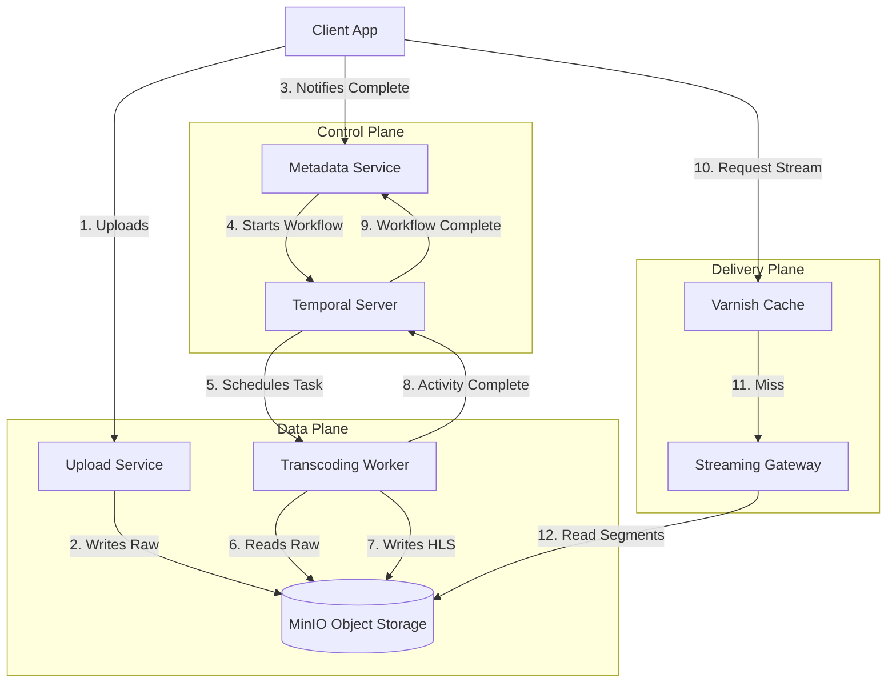

# VORA — SERVICE BOUNDARIES & ARCHITECTURE

> **Document Status:** RFC-002 (Draft)
> **Author:** System Architect
> **Context:** Component definition for the Vora Video Platform.

This document defines the strict boundaries between services in the Vora ecosystem. It enforces **Separation of Concerns** to ensure the system handles failures gracefully (as defined in System Flows) and scales components independently.

---

## 1. GLOBAL ARCHITECTURE RULES

1.  **Smart Endpoints, Dumb Pipes:** Business logic lives in Services and Workers, not in the transport layer (Kafka/HTTP).
2.  **Pass References, Not Data:** Video binaries **never** pass through API Gateways, gRPC calls, or Workflow payloads. We pass `s3_keys` or `upload_ids`.
3.  **Async First:** Operations exceeding 200ms (Transcoding, Analytics) are asynchronous.
4.  **Idempotency:** All state-changing operations (especially in Temporal Activities) must be idempotent.

---

## 2. CORE SERVICES

### A. Upload Service (The Ingest Edge)
**Role:** specialized high-throughput ingress for binary data. It implements the **TUS Protocol** to handle resume-able uploads over unstable networks.

*   **Owns:**
    *   TUS Server implementation.
    *   Writing raw bytes to MinIO (Temporary Bucket).
    *   Tracking upload offsets.
*   **Does NOT Do:**
    *   Video processing.
    *   User authentication (delegates to auth provider, validates tokens only).
    *   Database writes (other than internal TUS state).
*   **Data Ownership:**
    *   **MinIO:** `bucket-raw/`
    *   **Internal State:** `.info` files for TUS offset tracking.
*   **Dependencies:**
    *   MinIO (Write)
*   **Failure Behavior:**
    *   **Network Failure:** Client retries; Service resumes from offset.
    *   **Storage Failure:** Returns `5xx`; Client implements exponential backoff.
*   **THE HARD RULE:**
    > "The Upload Service does not know what a 'Video' is. It only knows what a 'File' is."

### B. Metadata Service (The Brain)
**Role:** The authoritative source of truth for business entities. It manages the lifecycle of a video from `CREATED` to `READY`.

*   **Owns:**
    *   User-facing APIs (REST/gRPC).
    *   Mapping `upload_id` (Technical) $\to$ `video_id` (Business).
    *   Triggering Temporal Workflows.
    *   Generating Signed URLs for playback/upload.
*   **Does NOT Do:**
    *   File I/O.
    *   Long-running tasks.
*   **Data Ownership:**
    *   **PostgreSQL:**
        ```postgres-sql
        Table: Videos
        - id (UUID)
        - title, description
        - state (CREATED, PROCESSING, READY, FAILED)
        - manifest_url
        ```
*   **Dependencies:**
    *   Temporal Client (to start workflows).
    *   Upload Service (to verify upload completion via callbacks/webhooks).
*   **Failure Behavior:**
    *   **DB Down:** API returns `503 Service Unavailable`.
    *   **Temporal Down:** API queues request or fails fast (Circuit Breaker pattern).
*   **THE HARD RULE:**
    > "No state mutation occurs without a database transaction."

### C. Temporal Workflow Engine (The Conductor)
**Role:** Orchestrates the distributed execution of video processing. Guarantees that if a video starts processing, it eventually finishes or fails cleanly.

*   **Owns:**
    *   Workflow State (History).
    *   Retries, Timeouts, and Sagas (Compensating transactions).
    *   Scheduling Activities.
*   **Does NOT Do:**
    *   Execute the actual transcoding (that's the Worker's job).
    *   Store business data (that's the Metadata Service's job).
*   **Data Ownership:**
    *   Internal Cassandra/SQL (Temporal History Shards).
*   **Dependencies:**
    *   Transcoding Workers (Pollers).
*   **Failure Behavior:**
    *   **Service Crash:** Replays history from event store; resumes execution exactly where it left off.
*   **THE HARD RULE:**
    > "Workflows are code, but they must be deterministic. No API calls or non-deterministic logic inside the Workflow Definition."

### D. Transcoding Worker (The Muscle)
**Role:** A stateless worker that polls Temporal for tasks. It wraps **FFmpeg**.

*   **Owns:**
    *   Fetching raw video from MinIO.
    *   CPU-intensive transcoding (1080p, 720p, 360p).
    *   Generating HLS segments (`.ts`) and playlists (`.m3u8`).
    *   Uploading processed artifacts to MinIO.
*   **Does NOT Do:**
    *   Decide *what* to encode (Workflow tells it).
    *   Update the database directly.
*   **Data Ownership:**
    *   None. Purely stateless.
*   **Dependencies:**
    *   MinIO (Read/Write).
    *   Temporal (Task Polling).
*   **Failure Behavior:**
    *   **FFmpeg Segfault:** Activity fails -> Temporal catches exception -> Retry Policy triggers -> Worker picks it up again.
*   **THE HARD RULE:**
    > "Input is Read-Only. Output is Write-Once. Never modify existing files."

### E. Streaming Gateway (The Delivery)
**Role:** The entry point for playback. It serves HLS manifests and segments, sitting behind the Varnish Cache.

*   **Owns:**
    *   Dynamic generation of the Master Manifest (adaptive bitrate logic).
    *   CDN/Cache Control headers.
    *   Proxying segment requests to MinIO (if not cached).
    *   On-the-fly Auth checks (Signed Cookies/Tokens).
*   **Does NOT Do:**
    *   Transcoding.
    *   Writes.
*   **Data Ownership:**
    *   None.
*   **Dependencies:**
    *   Metadata Service (to fetch video location).
    *   MinIO (to fetch segments).
    *   Varnish (Upstream caching).
*   **Failure Behavior:**
    *   **MinIO Slow:** Varnish serves stale content (Grace mode) if configured, else `504 Gateway Timeout`.
*   **THE HARD RULE:**
    > "Maximize Cache Hit Ratio. If Varnish misses, this service must respond in <50ms."

### F. Analytics Pipeline (The Observer)
**Role:** High-volume ingestion of playback events.

*   **Owns:**
    *   HTTP Ingest Endpoint (Fire-and-forget).
    *   Buffering/Batching events.
    *   Writing to ClickHouse.
*   **Does NOT Do:**
    *   Block the playback experience.
    *   Querying (Querying is done by a separate Dashboard Service or Metadata Service).
*   **Data Ownership:**
    *   **ClickHouse:**
        ```postgres-psql
        Table: PlaybackEvents (Engine = MergeTree)
        - event_time
        - video_id
        - user_id
        - event_type (play, pause, buffer)
        Partition Key: toYYYYMMDD(event_time)
        ```
*   **Dependencies:**
    *   ClickHouse.
*   **Failure Behavior:**
    *   **ClickHouse Down:** Drop events or buffer to disk/Kafka. Playback is **never** affected.
*   **THE HARD RULE:**
    > "Analytics writes are best-effort. Never crash the app because analytics failed."

---

## 3. INFRASTRUCTURE & STORAGE LAYOUT

### Object Storage (MinIO) Layout
Strict separation between "Raw" (Untrusted) and "Processed" (Public/Streamable) data.

```text
bucket-raw/
└── {upload_id}/
    └── original.mp4      <-- Written by Upload Service

bucket-processed/
└── {video_id}/
    ├── master.m3u8       <-- Generated by Worker
    ├── 1080p/
    │   ├── playlist.m3u8
    │   ├── seg_01.ts
    │   └── seg_02.ts
    ├── 720p/
    │   └── ...
    └── thumbnail.jpg
```

---

## 4. SERVICE INTERACTION DIAGRAM (Conceptual)


