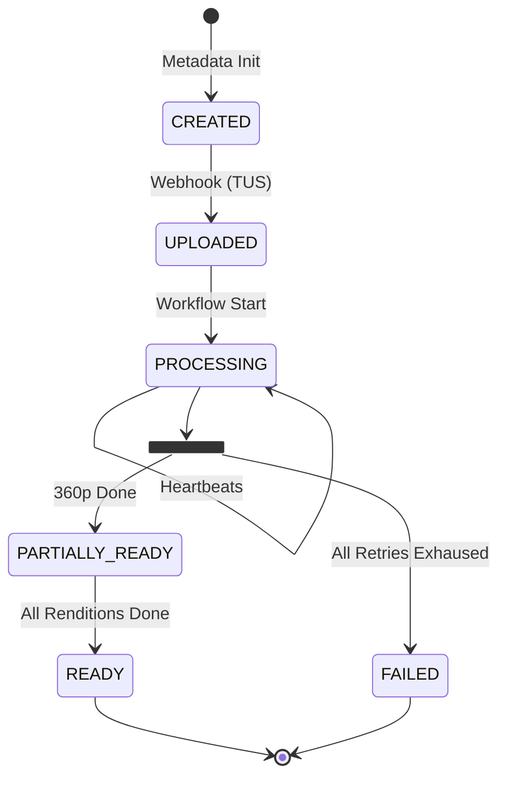
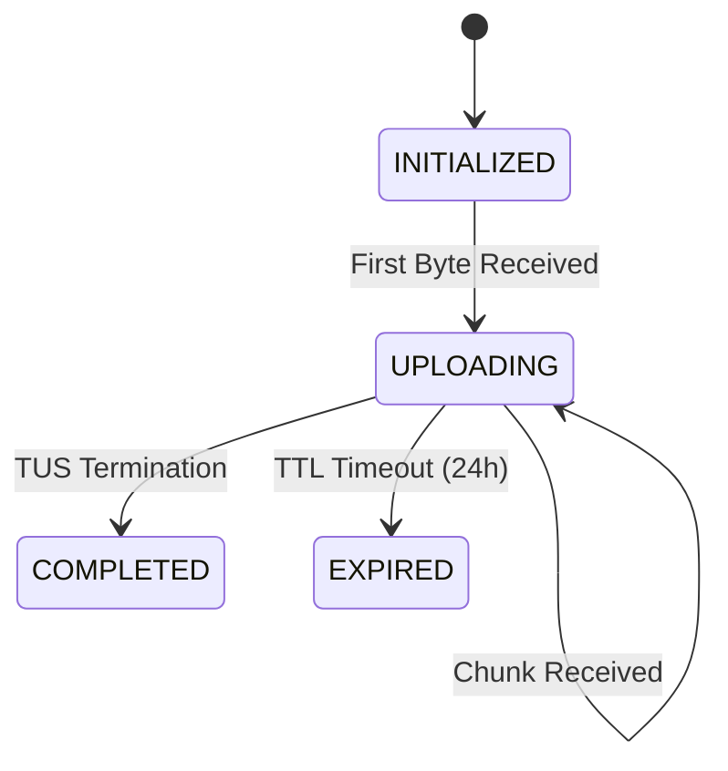

# VORA — STATE MACHINE DESIGN

> **Document Status:** RFC-003 (Draft)
> **Author:** System Architect
> **Context:** Defining the authoritative state transitions for the Vora Video Platform.

This document defines the **Finite State Machines (FSM)** that drive Vora. We define state *before* API endpoints to guarantee data consistency, handle partial failures, and ensure idempotency.

---

## 1. DESIGN PRINCIPLES

1.  **State is Explicit:** We never guess the state of a video by checking if a file exists in S3. We check the database.
2.  **One Way Door:** Transitions are generally forward-only. A `READY` video cannot go back to `UPLOADING`.
3.  **Owner-Driven:** Only specific services are authorized to trigger specific transitions.
4.  **Idempotent Transitions:** Moving from `PROCESSING` $\to$ `PROCESSING` is a no-op, not an error.

---

## 2. THE VIDEO LIFECYCLE (Core FSM)

This is the business-critical state machine stored in the **Metadata Service (Postgres)**.

### State Diagram



### Transition Matrix (Authoritative)

| Current State | Target State | Trigger / Event | Actor | Type | Retryable? |
| :--- | :--- | :--- | :--- | :--- | :--- |
| **(Null)** | `CREATED` | `POST /videos` (Metadata received) | Metadata Service | Init | N/A |
| `CREATED` | `UPLOADED` | TUS Upload Complete Hook | Upload Service | Normal | Yes (Idempotent) |
| `UPLOADED` | `PROCESSING` | Temporal Workflow Started | Temporal | Normal | Yes |
| `PROCESSING` | `PARTIALLY_READY`| Activity `Transcode(360p)` Done | Temporal | **Optimization** | N/A |
| `PROCESSING` | `FAILED` | Workflow Failure (Max Retries) | Temporal | **Terminal** | No (Requires Manual Intervention) |
| `PARTIALLY_READY`| `READY` | Workflow Completed (All OK) | Temporal | Normal | Yes |
| `*` | `DELETED` | `DELETE /videos/:id` | Admin/User | **Terminal** | No |

### Failure Handling
*   **Retryable:** If `PROCESSING` fails (e.g., FFmpeg crash), Temporal manages the retry. The DB state remains `PROCESSING`.
*   **Terminal:** If the input file is corrupted (checksum mismatch), state moves to `FAILED`. No amount of retrying will fix a bad file.

---

## 3. THE UPLOAD LIFECYCLE (Ingestion FSM)

Managed by the **Upload Service**. This tracks the raw byte ingestion before the video exists as a business entity.

### State Diagram



### Transition Matrix

| Current State | Target State | Trigger | Actor | Notes |
| :--- | :--- | :--- | :--- | :--- |
| `INITIALIZED` | `UPLOADING` | `PATCH /files/{id}` | Client | Upload started |
| `UPLOADING` | `COMPLETED` | `HEAD /files/{id}` (Offset == Size) | Upload Service | Triggers webhook to Metadata Service |
| `UPLOADING` | `EXPIRED` | Cron Cleanup Job | System | Cleans up orphaned chunks in MinIO |

---

## 4. THE RENDITION LIFECYCLE (Worker FSM)

Managed inside **Temporal Workflow State**. This tracks individual quality layers (360p, 720p, 1080p).

> **Note:** This state is **not** usually stored in Postgres to reduce write load. It lives in Temporal History, but we project the aggregate result (`PARTIALLY_READY`) to Postgres.

### State Diagram

```text
PENDING -> SCHEDULED -> PROCESSING -> COMPLETED
                             |
                             V
                           FAILED (-> RETRY -> PROCESSING)
```

### Logic Rules
1.  **Dependency:** `1080p` transcoding only starts after `Thumbnail` generation is successful (optional rule for resource gating).
2.  **Aggregation:**
    *   If `360p` = COMPLETED $\to$ Video State = `PARTIALLY_READY`.
    *   If `All` = COMPLETED $\to$ Video State = `READY`.

---

## 5. DATABASE SCHEMA IMPLICATIONS

We design the schema to enforce these states.

### Table: `videos`
Located in **Metadata Service (Postgres)**.

```postgres-psql
CREATE TYPE video_status AS ENUM (
    'CREATED', 
    'UPLOADED', 
    'PROCESSING', 
    'PARTIALLY_READY', 
    'READY', 
    'FAILED'
);

CREATE TABLE videos (
    id UUID PRIMARY KEY,
    owner_id UUID NOT NULL,
    upload_id VARCHAR(255) UNIQUE, -- Link to TUS
    status video_status NOT NULL DEFAULT 'CREATED',
    
    -- Versioning for Optimistic Locking
    version INT NOT NULL DEFAULT 1, 
    
    -- Error tracking
    failure_reason TEXT,
    
    created_at TIMESTAMPTZ DEFAULT NOW(),
    updated_at TIMESTAMPTZ DEFAULT NOW()
);
```

### Table: `video_renditions` (Optional/Projection)
If we need to show the user exactly which qualities are available in the UI.

```postgres-psql
CREATE TABLE video_renditions (
    video_id UUID REFERENCES videos(id),
    quality VARCHAR(10) (CHECK quality IN ('360p', '720p', '1080p')),
    status VARCHAR(20) DEFAULT 'PENDING',
    s3_path TEXT,
    PRIMARY KEY (video_id, quality)
);
```

---

## 6. API IMPLEMENTATION STRATEGY (Preview)

Because we defined state first, our API implementation becomes simple state checks:

**GET /videos/{id}**
```json
{
  "id": "123",
  "status": "PARTIALLY_READY",
  "playback_url": "https://cdn.vora.com/123/master.m3u8",
  "available_resolutions": ["360p"] 
}
```

**Webhook Listener (Internal)**
```python
def handle_upload_complete(upload_id):
    # ATOMIC STATE TRANSITION
    # UPDATE videos SET status = 'UPLOADED' 
    # WHERE upload_id = $1 AND status = 'CREATED'
    
    if rows_affected == 0:
        return # Idempotency check: already handled or invalid state
        
    trigger_temporal_workflow(upload_id)
```